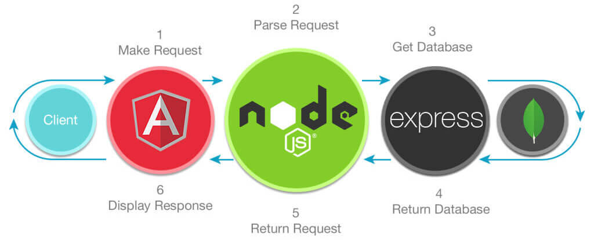

    

# MEAN Simple Starter
### Last Update: 2/2/2018
This MEAN starter repository is a full-stack development toolkit using the Javascript-based technologies MongoDB, Express, Angular, and Node.js.

    

## Versions
* MongoDB v3.6.2 (Mongoose v5.0.3)
* Express v4.16.2
* Angular v5.2.3
* Node.js v9.5.0

## Cloning the Project for Personal Use
### Installation
1. Clone this repo: `git clone https://github.com/stanleyeosakul/mean-simple-starter.git`
1. `cd` into the folder of the cloned repo
1. Run `yarn install` to install dependencies
1. Start your local MongoDB instance
1. Choose to run the development or production server
    * Development
        * Front End (Angular)
            * Run `ng serve`, and navigate to `http://localhost:4200/`. 
        * Back End (MongoDB, Express, Node.js)
            * Run `yarn run dev`, and navigate to `http://localhost:3000/`.
    * Production
        * Run `yarn run build`, and navigate to `http://localhost:3000/`.

## Built-in scripts
* `yarn run dev`
    * Builds the Angular project without build optimization into the `dist/` folder
    * Runs the `server.js` node app
* `yarn run build`
    * Builds the Angular project into the `dist/` folder
    * Runs the `server.js` node app

## Installed Packages
### Front-end
* [Angular 5](https://angular.io/)
* [Bulma CSS Framework v0.62](https://bulma.io/)
* [Font-Awesome v5.0.6](https://fontawesome.com/)

### Back-end
* [Express](https://expressjs.com/)
* [Mongoose](http://mongoosejs.com/)
* [Body-Parser](https://github.com/expressjs/body-parser)

### Development
* [Angular CLI v1.6.7](https://github.com/angular/angular-cli)
* [Morgan Logging library](https://github.com/expressjs/morgan)
* [Typescript](https://www.typescriptlang.org/)
